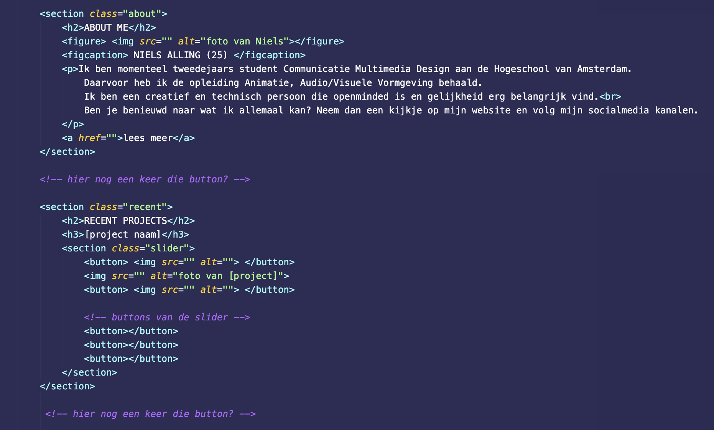

# Procesverslag Portfolio Niels Aling
In dit bestand is te lezen hoe het proces is gelopen van ontwerp van mijn portfolio tot de officiele website. Hierin zullen alle ideeën, veranderingen en resultaten komen te staan. Ook wordt hierin bijgehouden hoe lang ik tijd heb besteed aan alle onderdelen. 

<!-- voorbereiding -->

## 7 november 2022 (4uur en 20 min)

### 11:00 basis structuur (30 min)
Het aanmaken van mappen en bestanden. Opzet van het procesverslag.

#### wat moet er in mijn portfolio
- Recenten projecten
- Contact gegevens
- Linkjes naar social media 
- About me  

<!-- ontwerp -->

### 12:00 Wireframe Schetsen (50 min)
Ik ben begonnen aan het schetsen van wireframes voor de mobiele versie van mijn portfolio.
Om een idee te krijgen van hoe ik het er uit wil laten komen te zien heb ik besloten om verder te gaan met het maken van een moodboard.

### 13:00 Moodboard en fonts (1 uur)
Om een beter beeld te krijgen van de stijl waarin ik mijn portfolio wil maken heb ik een moodboard gemaakt.
Ook ben ik gaan zoeken naar fonts die ik zou kunnen gebruiken. De fonts die ik wil gebruiken zijn:
- Ohm Medium (Ontworpen door Tal Leming. Van Type Supply.)
- Industry inc Base (Ontworpen door Mattox Shuler. Van Fort Foundry.)
- termina medium (Ontworpen door Mattox Shuler. Van Fort Foundry.)

Allemaal afkomstig van https://fonts.adobe.com/ 

### 14:00 Style guide (2 uur)
Vanuit het Moodboard ben ik de titel gaan ontwerpen en begonnen aan de style guide.

## 8 november 2022 (3,5 uur)

### 12:30 Digitale Mobiele Wireframes(2 uur)
Ik ben begonnen met de digitale wireframes voor de mobiele versie, omdat ik mobile first wil werken en de website zo responsive mogelijk wil maken.

### 15:00 Digitale Desktop Wireframes (1,5 uur)
Na de mobiele wireframes ben ik doorgegaan naar de desktop wireframes.

## 10 november 2022 (5 uur)

### 10:30 Style Assets (2 uur)
Nu ik de wireframes heb heb ik een beter beeld van hoe mijn stijl er uit moet komen te zien, dus ben ik aan de slag gegaan met het maken van assets zoals een menu, knoppen en andere iconen.

### 13:00 Style Assets (2 uur)
Verder met Style Assets

### 16:00 Style Assets (1 uur)
Verder met Style Assets

## 15 november 2022 (3,5 uur)

### 10:30 (1 uur)
Verder met Style Assets

### 16:30 Screen Designs Mobile (2,5 uur)
Na het maken van assets en de wireframes kan ik gaan beginnen aan de mobile screen designs. 

## 21 november 2022 (2,5 uur)

### 15:00 Screen Designs Desktop (2,5 uur)

## 1 december 2022 (1,5 uur)

### 12:30 Style Guide (1,5 uur)
Nu de vormgeving van de schermen af is kan ik alle onderdelen netjes in de stijl guide zetten. Hierbij is te zien welke kleuren, typografie en assets ik gebruik.

### 3 december 2022 (1,5 uur)

## 10:00 Style Guide  (1,5 uur)
Verder met style guide 

### 8 december 2022 (50 minuten)

## 11:00 Style Guide (50 minuten)
Style Guide afmaken

<!-- vanaf hier gaat het om het realiseren van de website -->

## 31 januari 2023 (1,5 uur)

### 10:00 Breakdown schets (1,5 uur)
Voor ik begin aan de website moet ik eerst weten hoe ik alle onderdelen ga plaatsen in HTML. Daarvoor heb ik een breakdownschets gemaakt. Hierdoor heb ik een duidelijk overzicht van de opbouw van mijn website.

## 1 februari 2023 (2 uur)

### 14:00 HTML Structuur (2 uur)
Op wat afbeeldingen en linkjes na zit de HTML structuur in elkaar. Deze bestaat uit 3 pagina's. De eerste pagina is eigenlijk een soort one pager waarbij je door de hele website heen scrollt. Bij de about me page is een extra pagina met meer informatie en het zelfde gelt voor de projecten. Hieronder screenshots van mij code tot nu toe.

## 6 februari 2023 (1 uur en 45 minuten)

### 11:30 CSS Start (45 minuten)
Nu de structuur van de HTML in elkaar zit kan ik gaan beginnen aan vormgeving van de website. 
Hierbij heb ik begonnen met het toevoegen van het logo en de lettertypes en het aanmaken van variabelen voor de kleuren van de website.

### 12:30 CSS header (1 uur)
Ik ben doorgegean met het eerste deel van de pagina. Hier heb ik er voor gezorgd dat de menu button en de down button fixed zijn gepositioneerd en dat de header sticky is. Dit zorgt er voor dat hij met scrollen niet van hetr scherm af gaat. (deze ga ik later met media query kleiner maken zodat deze netjes in een balkje past)

## 13 februari 2023 (2,5 uur)

### 11:30 HTML en CSS (2,5 uur)
Ik ben doorgegaan met het invoeren van wat images en het vormgeven van de about pagina. Daarnaast heb ik van de menu button een link gemaakt omdat de button geen svg's pakt. Ook had ik moeite met het centreren van een position fixed knop en die heb ik met behulp van Stackoverflow weten op te lossen (Bron: https://stackoverflow.com/questions/2005954/center-a-positionfixed-element). Daarnaa liep ik wat vast met een stukje vormgeving van een afbeelding van mezelf. Ik wilde daar een glow effect in en heb geprobeerd dat op te lossen door het effect op de figure te zetten en deze met z-index naar boven te plaatsen. Dit lukte echter niet.
Na een tijdje kwam ik op het idee om dit met een background-image op te lossen. Dit werkte wel.

[img van die foto]

## 14 februari 2023 (3 uur)

### 15:00 Css recent projects (3 uur)
Ik  en doorgegaan naar de volgende section. Deze wilde ik opdelen in een grid, maar moest daarvoor mij geheugen weer even opfrissen. Via de website:
https://css-tricks.com/snippets/css/complete-guide-grid/ ben ik er achter hoe ik dit ook al weer moest doen.

Met veel moeite en uit proberen is dit dan uiteindelijk ook gelukt. Voor de test heb ik een :hover op de onderste drie buttons gezet om te kijkekn hoe het er uit ziet als deze ingedrukt worden. Hier het resultaat tot nu toe:

[img van redent projects]

## 15 februari 2023 (45 minuten)

### 13:00 CSS socials (45 minuten)
Nu de section recent projects redelijk in elkaar zit, ga ik door naar de volgende section; socials. Deze wil ik of met een grid positioneren of met display flex met een wrap er op. zodar deze alvast responsive is voor desktop. 

Om te beginnen moet ik eerst de icons in de HTML plaatsen. Daarna heb ik ze met display flex en flex wrap op de juiste plek gekregen. Nu alleen nog de goede linkjes toevoegen.

<!-- [img van socials] -->

## 22 februari 2023 (4 uur)

### 10:00 CSS contact (2 uur)
Als eerste heb ik de icons van LinkedIn, mail en telefoon in de html gezet. Vervolgens heb ik daar de juiste linkes aan gekoppeld.

Voor de mail heb ik even opgezocht hoe dit precies werkt. Dat heb ik gevonden op: https://www.tutorialspoint.com/html/html_email_links.htm
Voor het telefoon nummer heb ik hetzelfde gedaan en gevonden via: https://blog.hubspot.com/website/html-telephone-link

Nu alle linkjes goed staan wil ik alles gaan centreren, de plaatjes kleiner maken en nog een foto van mezelf invoegen.

#### 12:00 Probleem 1 (1 uur)
Hier kom ik er achter dat ik tegen het eerste probleem aan loop. Mijn scherm is ineens breder en ik snap niet hoe dit komt.

Na een tijdje zoeken kwam ik er achter dat het lag aan het grid dat ik had gemaakt in de slider section. Ik merkte dat als ik de afbeelding groter maakte dan 7em dat het aan de rechterkant dingen weg ging duwen. Omdat ik zelf het probleem niet opgelost kreeg heb ik een nieuwe slider gemaakt met ChatGPT.

https://chat.openai.com/chat/9050d0c3-77c8-4798-b0a7-ef73f24ee389 

### 13:00 ChatGPT (1 uur)
In chatGPT heb ik een slider laten maken en deze ook deels werkend gekregen. Alleen op de volgende slide laat hij de foto niet zien. Dit probeer ik nu op te lossen samen met chatGPT.

## 26 februari 2023 (4 uur)
Omdat de tijd een beetje dringt met het vinden van een stage en ik heb geleerd over progressive enhancement heb ik besloten om de slider eerst alleen met html en css te maken. Wanneer dit af is kan ik altijd nog javascript toevoegen om mijn website te verbeteren.

### 11:30 CSS Slider (1 uur)
De slider werkt met overflow scroll.

### 12:30 Scroll Snap (3 uur)
Omdat ik graag wil dat de site soepel van section naar section springt ben ik scroll snap gaan onderzoeken. Ik heb gevonden dat ik het beste scroll-snap-type: y mandatory; kan toevoegen omdat deze over de y axis gaat en van het ene snap point naar het andere snap point springt en dat is precies wat ik nodig heb. 
Bron: https://developer.mozilla.org/en-US/docs/Web/CSS/scroll-snap-type

Het probleem is dat de main section een bepaalde hoogte nodig heeft om dit te laten werken, maar dan krijg ik problemen met de header. 

## 27 februari 2023 ()

### 10:00 Aanpassing header en main Scroll Snap (2 uur)
Omdat ik niet helemaal kreeg wat ik wilde met de scroll snap heb ik de header aangepast zodat ik de main makkelijker een hoogte kon geven. Nu werkt de Scroll Snap wel. 

### 12:00 Scroll Snap button (2 uur)
Omdat ik ook met een knop wil kunnen sliden naar de volgende section moet ik eerst wat onderzoek doen hoe ik dat voor elkaar krijg. Het was lastig om alles op de goeie plek te krijgen met position absolute. Ik heb er voor gekozen het maar zo te laten en eventueel later te kijken naar hoe ik het mooier kan krijgen.

bron: https://www.w3docs.com/snippets/html/how-to-create-an-anchor-link-to-jump-to-a-specific-part-of-a-page.html

### 17:00 Snap Button (2,5 uur)
Na heel erg lang dingen geprobeerd te hebben ben ik er eindelijk uit gekomen. Door wat te klooien met de hoogte van sections, display flex en nog wat dingen werkt het nu bijna zoals ik wil. Alleen wil ik nog dat de transitie wat soepeler gaat. Wanneer dat gelukt is ga ik verder met het menu dat nog moet werken. Dit heb ik weten te fixen door de scroll-behaviour op smooth te zetten.

Bron: https://stackoverflow.com/questions/7717527/smooth-scrolling-when-clicking-an-anchor-link

### 19:30 Menu (2 uur)
Nu het grootste deel van de website in elkaar zit kan ik het menu gaan fixen. Daar heb ik ineerste instantie buttons in gezet, maar deze ga ik vervangen met linkjes. Later ga ik progressive enhancement goevoegen en de linkjes weer vervangen door buttons. Ik heb uiteindelijk het menu weten te toggelen met javascript.

[afbeelding javascript]

### 21:00 Media Queries (1 uur)
Nu de website werkt op mobiel wil ik het responsive gaan maken met media queries. Ik begin met een middelmaat (tablets) en gebruik hievoor het template: Ipad Air. Dit had ik redelijk snel gefixt. De volgende stap is de desktop versie.

## 3 maart 2023 (2 uur)

### 16:30 Desktop versie maken (2 uur)
Voor de desktop versie ben ik begonnen met het menu icon weghalen en de navigatie bar aan de linker kant te plaatsen. Ik wilde hier in eerste instantie dat de letters van boven naar beneden zouden gaan, maar dat moest ik even opzoeken. Dit heb ik gevonden op https://developer.mozilla.org/en-US/docs/Web/CSS/text-orientation. Na een tijdje klungelen met code heb ik het enigzins gekregen zoals ik wilde. 

## 5 maart 2023 (4 uur)

### 12:00 Desktop versie (3 uur)
Nu moet ik nog met media queries er voor zorgen dat de rest van de website ook werkt zoals het dat doet op mobiel. Daarvoor heb ik de volgende dingen aangepast:

- Menu button weghalen 
- navigatiebar aan de zijkant zetten 
- Tekst verticaal maken 
- Kleine aanpassigen aan maximale breedte en lettergrootte
- De project slider wrappen ipv scroll hidden 
- Plaatjes en wat knoppen kleiner maken 

### 15:30 Kleine aanpassingen / toevoegingen (1 uur)
Ik kwam nog een paar kleine dingen tegen die ik nog niet had gedaan. Zoals projecten in de slider zetten en linkjes toevoegen aan de homepage (dit zijn nu nog 3 nietwerkende knoppen). Ook heb ik er nog een linkje aan toegevoegd.

## 7 maart 2023 (3 uur)

### 13:30 Projecten importeren (3 uur)
Als een van de laatste dingen die ik nog moet doen is mijn projecten in mijn HTML zetten. Daarna zal ik nog een laatste check doen of alles werkt en responsive is. 

## Totaal aantal uur
57 uur en 40 minuten 

## Bronnenlijst 

### Typografie
- Ohm Medium (Ontworpen door Tal Leming. Van Type Supply.) https://fonts.adobe.com/ 
- Industry inc Base (Ontworpen door Mattox Shuler. Van Fort Foundry.) https://fonts.adobe.com/ 
- termina medium (Ontworpen door Mattox Shuler. Van Fort Foundry.) https://fonts.adobe.com/ 

### Outer Glow
- https://unused-css.com/blog/css-outer-glow/

### Position Fixed Center
- https://stackoverflow.com/questions/2005954/center-a-positionfixed-element 

### Css Grid
- https://css-tricks.com/snippets/css/complete-guide-grid/

### Contact links mailto and phonenumber
- https://www.tutorialspoint.com/html/html_email_links.htm
- https://blog.hubspot.com/website/html-telephone-link

### ChatGPT 
- https://chat.openai.com/chat/9050d0c3-77c8-4798-b0a7-ef73f24ee389

### Scroll-Snap
- https://developer.mozilla.org/en-US/docs/Web/CSS/scroll-snap-type
- https://www.w3docs.com/snippets/html/how-to-create-an-anchor-link-to-jump-to-a-specific-part-of-a-page.html
- https://stackoverflow.com/questions/7717527/smooth-scrolling-when-clicking-an-anchor-link

### Scrollbar styling
- https://www.stefanjudis.com/snippets/how-to-color-the-browser-scrollbar-across-browsers/

### Text Orientation
- https://developer.mozilla.org/en-US/docs/Web/CSS/text-orientation

